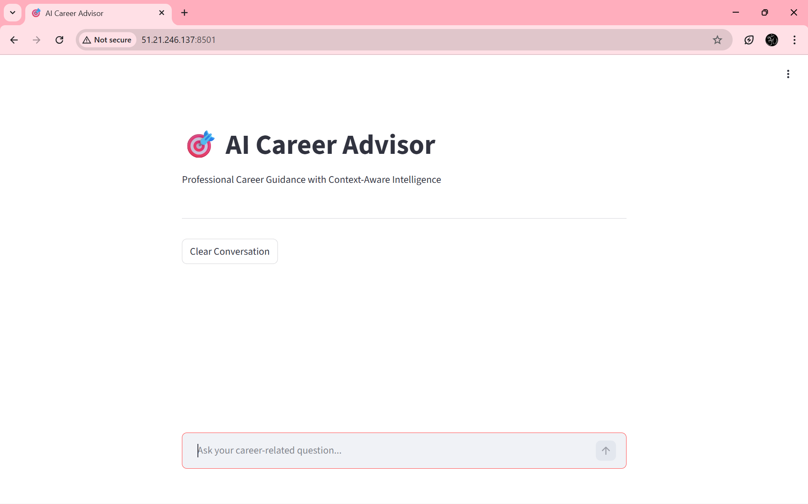
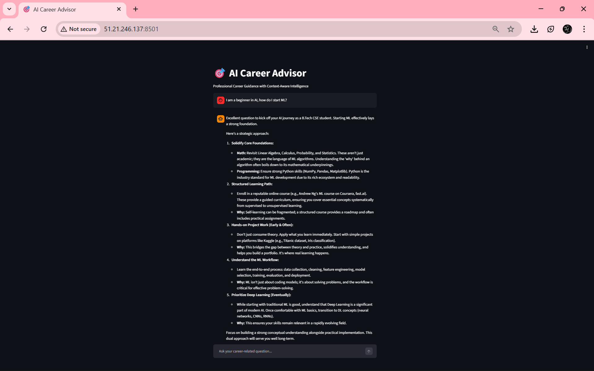
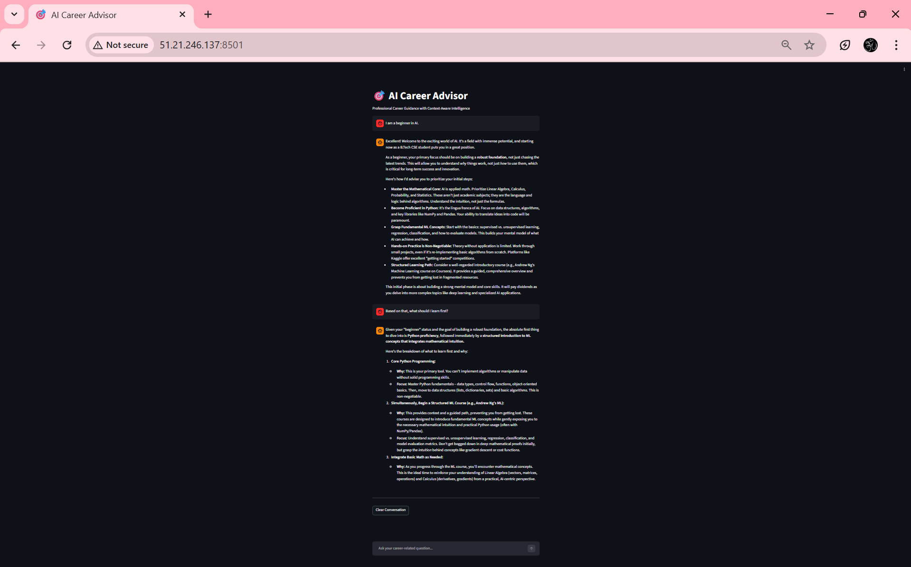
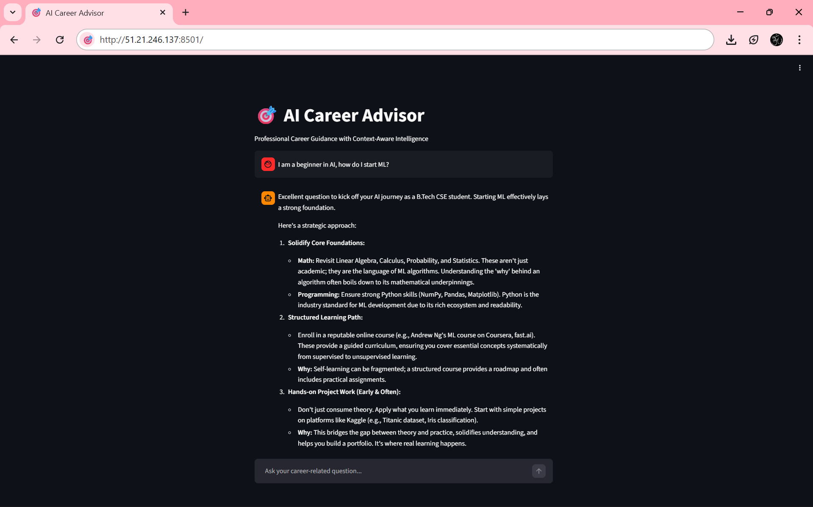
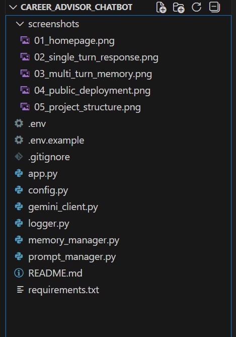

# 🎯 AI Career Advisor Chatbot

A production-ready, context-aware AI Career Advisor built using **Streamlit** and **Google Gemini (gemini-2.5-flash)**.

The chatbot provides structured career guidance for students interested in AI, Machine Learning, Data Science, and related domains.

🔗 GitHub Repository:  
https://github.com/kishore-239/ai-career-advisor-chatbot

---

## 🚀 Live Deployment

Currently deployed on AWS EC2.

Public URL:
http://51.21.246.137:8501

(Note: Public IP may change if the EC2 instance is stopped.)

---

## 🧠 Key Features

- Context-aware multi-turn conversation
- Structured career guidance format:
  - Career Assessment
  - Skill Gaps
  - Learning Plan
  - Projects
  - Interview Focus
- Modular architecture
- Secure API key management using `.env`
- Production deployment on AWS EC2
- Background execution using `nohup`
- Clean and minimal folder structure

---

## 🏗 Architecture Overview

User  
⬇  
Streamlit UI (`app.py`)  
⬇  
Prompt Manager  
⬇  
Memory Manager (conversation context)  
⬇  
Gemini Client  
⬇  
Google Gemini API (gemini-2.5-flash)  
⬇  
Structured Response Rendering  

---

## 📂 Project Structure

```
ai-career-advisor-chatbot/
│
├── screenshots/
│   ├── 01_homepage.png
│   ├── 02_single_turn_response.png
│   ├── 03_multi_turn_memory.png
│   ├── 04_public_deployment.png
│   ├── 05_project_structure.png
│
├── app.py
├── config.py
├── gemini_client.py
├── memory_manager.py
├── prompt_manager.py
├── logger.py
├── requirements.txt
├── .env.example
├── .gitignore
└── README.md
```

---

## 📸 Application Preview

### 🏠 Homepage


### 💬 Single Turn Response


### 🔁 Multi-Turn Context Awareness


### 🌍 Public Deployment on AWS EC2


### 🗂 Clean Modular Project Structure


---

## ⚙️ Tech Stack

- Python 3
- Streamlit
- Google Gemini API (`gemini-2.5-flash`)
- AWS EC2 (Ubuntu 24.04)
- Virtual Environment (venv)
- Environment Variables (.env)

---

## 🔐 Environment Configuration

Create a `.env` file in the project root:

```
GEMINI_API_KEY=your_api_key_here
MODEL_NAME=gemini-2.5-flash
TEMPERATURE=0.7
MAX_OUTPUT_TOKENS=800
```

Important:
- Never commit `.env`
- Rotate API keys if exposed
- `.env` is excluded via `.gitignore`

---

## 🖥 Local Setup

Clone the repository:

```
git clone https://github.com/kishore-239/ai-career-advisor-chatbot.git
cd ai-career-advisor-chatbot
```

Create virtual environment:

```
python -m venv venv
```

Activate environment:

Mac/Linux:
```
source venv/bin/activate
```

Windows:
```
venv\Scripts\activate
```

Install dependencies:

```
pip install -r requirements.txt
```

Run locally:

```
streamlit run app.py
```

---

## ☁️ AWS EC2 Deployment Summary

1. Launch Ubuntu EC2 instance
2. Configure inbound rule for port 8501
3. SSH into instance
4. Upload project files
5. Create virtual environment
6. Install dependencies
7. Add `.env`
8. Run in background:

```
nohup streamlit run app.py --server.port 8501 --server.address 0.0.0.0 > output.log 2>&1 &
```

Access via:

```
http://<EC2_PUBLIC_IP>:8501
```

---

## 🧩 Design Principles

- Separation of concerns
- Modular architecture
- Secure secret handling
- Production-focused deployment
- Minimal complexity
- Clean repository hygiene

---

## 🔮 Future Improvements

- HTTPS using Nginx reverse proxy
- Custom domain integration
- Docker containerization
- CI/CD automation
- Persistent chat storage
- User authentication

---

## 👨‍💻 Author

Krishna Kishore Kudithi  

GitHub: https://github.com/kishore-239

---

## 📌 Disclaimer

This project is for educational and portfolio purposes.  
Career suggestions are AI-generated and should not replace professional guidance.
